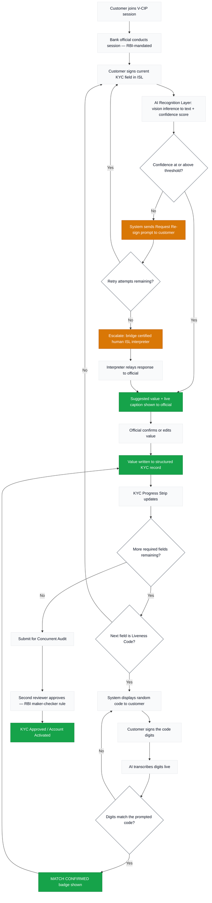

# SignKYC — Need To Be Done

> [!WARNING]
> **CURRENT STATE (August 19, 2026): MLP Model Training Interrupted**
> We are in the middle of training the MLP classifier for static alphabet/digit poses.
> - **Frontend:** Wired up! `mlpEngine.ts` is fully integrated into `VideoPanel.tsx`. 
> - **Backend Scripts:** `preprocess_static.py`, `train_static_mlp.py`, and `train_static_mlp.bat` are written.
> - **Pending Action:** The offline feature extraction (`python preprocess_static.py` in `isl_dtw/`) was stopped midway because the dataset has ~14,000+ images and takes ~2.5 hours on CPU. To continue, you must:
>   1. Re-run `train_static_mlp.bat` (or manually run `preprocess_static.py` then `train_static_mlp.py`).
>   2. Wait for the `tfjs_model` to be exported and copied to `/public/tfjs_model/`.
>   3. Verify functionality on the frontend.

## Current Status & Completed Items
What's genuinely built and working:
- **Full UI component set:** Every screen matches the design spec (Video panel, AI assist panel, KYC progress strip, footer, audit/edit/interpreter/customer-view modals).
- **Demo State Switcher:** 4 scripted states (normal / liveness / escalated / complete) are functional.
- **Request Re-sign:** Retry counter works correctly (after 2 retries it auto-opens the Interpreter modal).
- **AI Audit Report API (`/api/generate-audit-report`):** A real Gemini call that writes the final audit summary (falls back to a canned summary if no API key is set).
- **Webcam Integration:** A working webcam preview (`getUserMedia`) in the video panel.
- **Supabase Integration Setup:** Supabase insert code exists in `AuditModal.tsx` (though schema/project not yet connected).
- **Deployment Config:** `vercel.json` and Vite configuration are set up.

---

## What NOT to build (Out of Scope for Demo)
- A real trained CV/gesture-recognition model (Gemini vision API is sufficient).
- Real integration with an actual interpreter service (SignAble or otherwise) — keep the modal scripted.
- Real two-party WebRTC calling between customer and official — the current single-app simulation is enough for a demo video or live walkthrough.

---

## Action Plan: Tasks to be Completed (In Sequence)

### Phase 1: Core AI Recognition Pipeline
The biggest real gap. Everything currently on screen is hardcoded.
- [ ] **Task 1.1: Frame Capture Logic:** Implement logic in `VideoPanel.tsx` to capture frames from the live video feed (canvas snapshot on an interval, or on-demand).
- [ ] **Task 1.2: API Wiring:** POST captured frames to the existing `/api/analyze-sign` endpoint.
- [ ] **Task 1.3: Dynamic State Update:** Replace the hardcoded `confidenceScore` and `liveCaptionText` state in `App.tsx` with values returned from the real API response.
- [ ] **Task 1.4: Real Confidence Thresholds:** Implement an actual threshold check driven by the API's confidence score to trigger appropriate branching (e.g., auto-confirm vs. request re-sign).

### Phase 2: Environment & Backend Polish
- [ ] **Task 2.1: API Keys:** Set a real `GEMINI_API_KEY` in `.env` so `/api/generate-audit-report` and `/api/analyze-sign` return real AI output.
- [ ] **Task 2.2: Deployment Verification:** Confirm the Vercel deployment actually works end-to-end.

### Phase 3: Liveness Verification (Optional / Scripted)
- [ ] **Task 3.1: Liveness Comparison:** Wire the `handleTriggerLiveness` random code generation to the real recognition pipeline to compare the signed response against the prompted digits. (If time is short, keep this scripted for the demo).

### Phase 4: Data Persistence (Optional)
- [ ] **Task 4.1: Supabase Setup:** Create the `kyc_sessions` table in a real Supabase project.
- [ ] **Task 4.2: Real Database Insertion:** Update `src/lib/supabase.ts` with real credentials to ensure the insert in `AuditModal.tsx` persists data. (Skip if not required for the demo pitch).

### Phase 5: Customer-Side View
- [ ] **Task 5.1: Customer View Validation:** Ensure `CustomerSideModal` correctly simulates the customer view for the demo. No actual second client is needed, just an inspectable preview.

---

### Project Flow Reference

